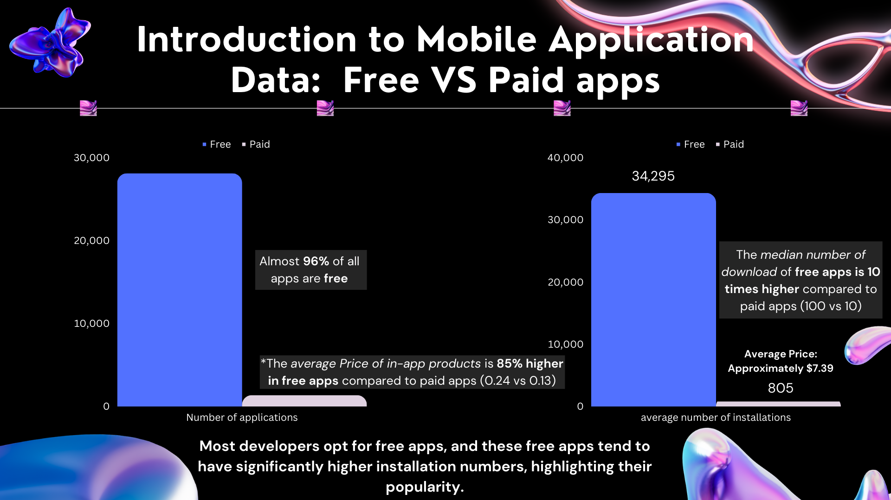
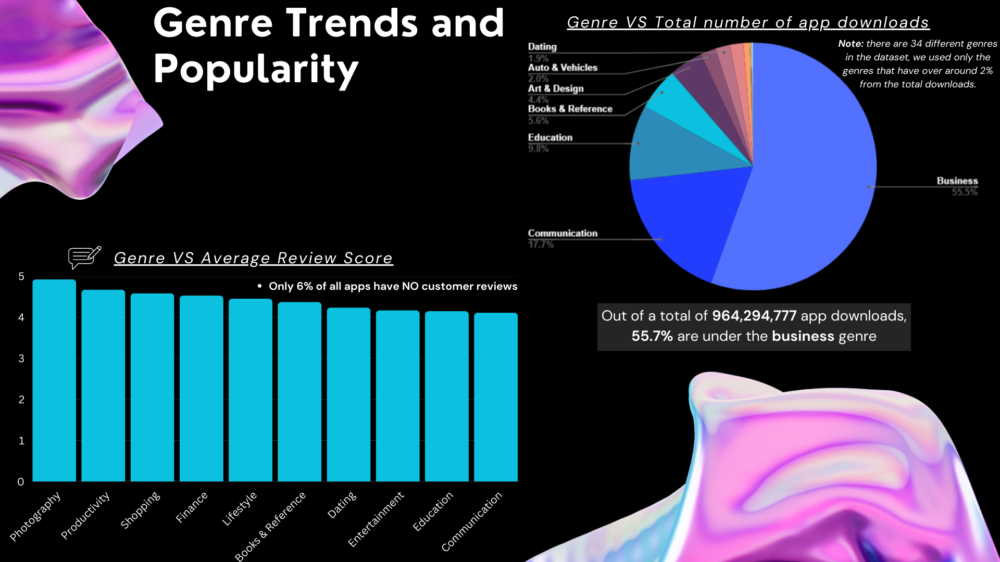
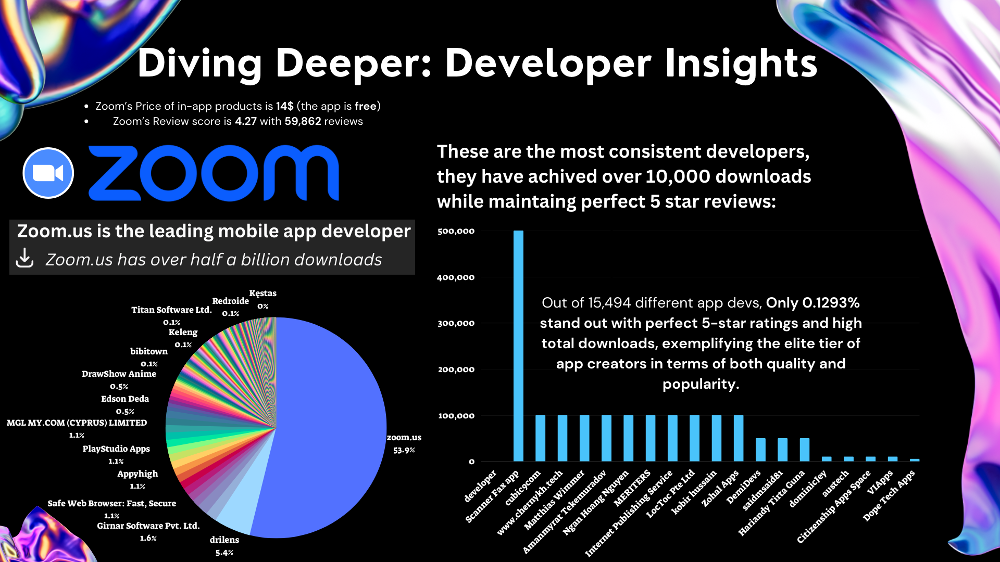
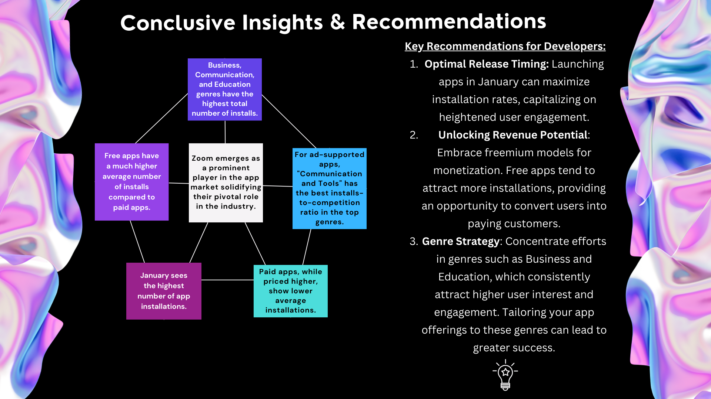

# Unlocking-Mobile-Application-Insights-A-Comprehensive-Data-Analysis
Unlocking Mobile Application Insights: A Comprehensive Data Analysis

## Project Objective
- Analysis of Medical Cannabis approvals in Israel (years 2018-2020)
- Analizing the reasons for different prescriptions
- Creating a dynamic report aimed at Medical Cannabis entrepreneurs

## Technologies Used:
- [x] Data Source [Open Data on Medical Cannabis csv](https://www.meida.org.il/?p=11491)
- [x] SQL table - hosted on Google BigQuery
- [x] Presentation - Canva

## Agenda

| *Agenda* | 
| ----------- | 
| Introduction: free Vs paid apps | 
| Diving Deeper: Developer Insights |
| Exploring Seasonal trends |
| Effect of In - App advertisment | 
| Conclusive Insights & Recommendations | 

## The Presentation

 

[Link to Canva](https://www.canva.com/design/DAFvRadSMgk/f1HwiV3kZu8Nkrpg9uk_Tw/watch?utm_content=DAFvRadSMgk&utm_campaign=designshare&utm_medium=link&utm_source=publishsharelink)

