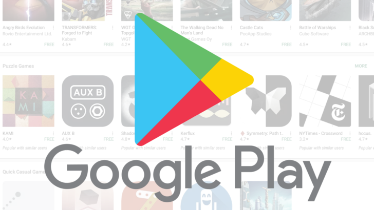

# Unlocking-Mobile-Application-Insights

Unlocking Mobile Application Insights: A Comprehensive Data Analysis

## Introduction

Today, more and more businesses are offering their services through mobile applications. Because of this massive number of apps it is hard to compete and get your product in front of potential customers. So, it is important to make thorough research into your niche category and find out how you would stack up against your competitors.

This case study aims to leverage Google SQL to analyze the Google Playstore dataset, which contains details about the Apps in playstore:  the app, its developer, pricing, genre, and installation statistics.

The primary objectives are to explore the data, extract meaningful insights, and create a presentation summarizing the findings, in order to deliver insights to understand customer demands better and thus help developers to popularize their applications.

This project was designed to assess my ability to handle non-"clean" data and identify insights within it, similar to real-world scenarios in the tech industry, especially in roles that involve analyzing data trends, There wasn't one right approach, also, the project was designed to assess my ability to reveal relevant business implications alongside data analysis.

## Data Description: The dataset comprises the following columns:

| *Field name* | *Description* |
| ----------- | ----------- |
| appId | Google Play app ID |
| developer | Developer's name |
| developerId |Developer's unique ID |
| developerWebsite | Developer's website |
| free | Indicates whether the app is free or paid (1 == free) or not (0 == paid) |
| genre | App's genre |
| genreId | Genre with subcategory |
| inAppProductPrice | Price of in-app products |
| minInstalls | Number of installs |
| ratings | App's Ratings |
| adSupported | Indicates whether the app is add supported or not (1 == adSupported) or not (0 == doesn't) |
| containsAds | Indicates whether the app containsAds or not (1 == containsAds) or not (0 == doesn't) |
| reviews | App's Total reviews |
| score | Score on Google Play|
| summary | Short description |
| title | The app's Name |
| releaseDate | The date when the app was released |
| updateDate | The date when the app was updated |
| price | App's Price |
| maxprice | Max price for in-app products |
| minprice | Min price for in-app products |

*I only showcased the releavnt columns which I chose to use in my data analysis process (there are 36 columns in the original dataset)

## Technologies Used:
- [x] Data Source: Google PlayStore Android App Data: google-play-dataset-by-tapivedotcom.csv [tapive, ](https://tapive.com/)
[Familiar dataset from Kaggle *our BigQuery dataset has 29,456 apps (rows)](https://www.kaggle.com/datasets/lava18/google-play-store-apps)
- [x] SQL table - hosted on Google BigQuery [Link to SQL script](BigQuerySQLScript.sql)
- [x] Google Sheets & Microsoft Excel 
- [x] The presentation - Canva

## The Presentation
[Link to the Canva presentation](https://www.canva.com/design/DAFvRadSMgk/f1HwiV3kZu8Nkrpg9uk_Tw/watch?utm_content=DAFvRadSMgk&utm_campaign=designshare&utm_medium=link&utm_source=publishsharelink)

 
